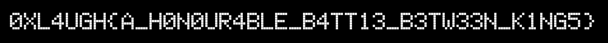

# Chessato

The game is made with Unity, build with Mono, so we can easily patch the game.

Challenge says: `Can you beat me in 1 move?`

By decompiling the `Assembly-CSharp.dll`, we can beat the game by catching the opposite king with our king.
So patch the move of King to go anywhere, and catch the opponent.

flag is: **0XL4UGH{A_H0N0UR4BLE_B4TT13_B3TW33N_K1NG5}**