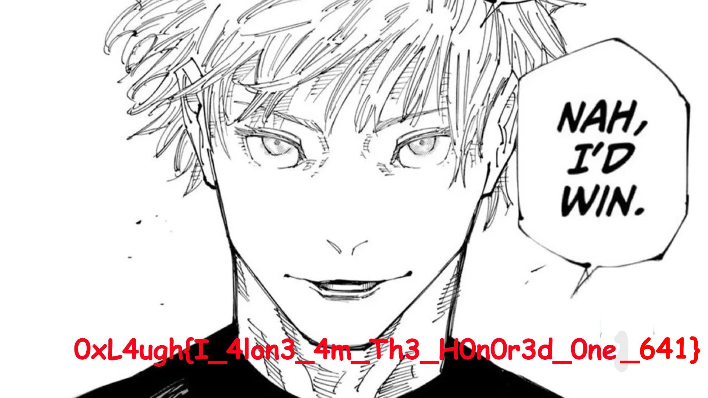

# The Joker 2

Inside the zip file, the file `Ryōiki Tenkai.exe` greets you.
Hmm, seems like something will happen when we run it...

Also `Would you lose.png`.\


By reversing the exe file, we can get the logic:
1. Get all .txt and .png files in Desktop and Downloads folders.
2. Zip the files.
3. Generate random 4-byte key and xor within the zip file.
4. Add the header, CRC32, 8-byte extended 4-byte key, length, in front of the xor-zip file.
5. Convert No 4.'s payload into RGBA array structure, and generate png file.

Now we can finally recover the flag.

```python
import cv2

image = cv2.imread("Would you lose.png", flags=cv2.IMREAD_UNCHANGED)
f = open("data", "wb")

for row in image:
    for col in image:
        f.write(bytes(col))

f = open("data", "rb")
f.read(4)
keys = f.read(4)
f.read(8)

data = f.read()
data = [b^keys[i % 4] for i,b in enumerate(data)]
for i in range(len(data)//4):
    x = 4*i
    data[x], data[x+2] = data[x+2], data[x]

f = open("out.zip", "wb")
f.write(bytes(data))
```

Inside the out.zip, there is `Stand_Proud_You_Are_Strong.png`.\


flag is: **0xL4ugh{I_4lon3_4m_Th3_H0n0r3d_0ne_641}**