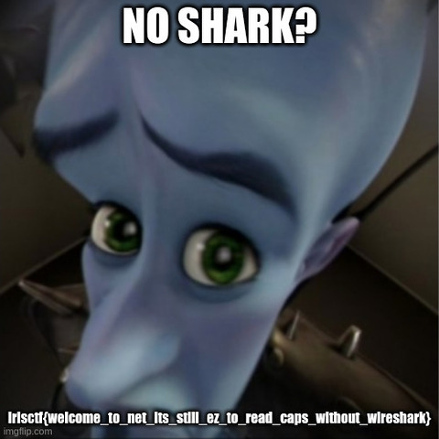

# No Shark?

`Description`

`Solution`

JPEG가 쪼개져서 보내진 덤프

잘 설정하면 wireshark로 볼 수도 있음

내용을 연결한 다음 JPEG 형식으로 저장하면 됨
```python 
with open("noshark.txt",'r') as f:
    data=f.readlines()
res = ''
for line in data[3:43]:
    if line[68:68+8] == '1a6f815e':
        # parse data
        res += line[0x42*2:].strip()

dat = bytes.fromhex(res)
with open('out.jpeg','wb') as f:
    f.write(dat)
```



