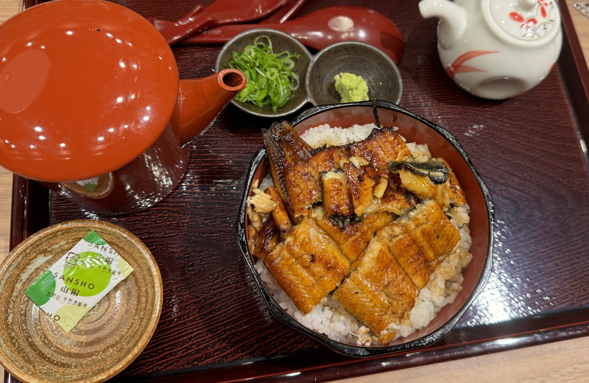

# Not Eelaborate

'After my long train ride, I visited a deer park and got to feed the wildlife. There were so many restaurants to choose from but I was craving eel. I really like the soup mixed in with the rice and fish. The wasabi threw me off since I don’t normally have it served this way.

I would recommend this place if you want to find a quiet restaurant to eat at, and wouldn’t mind finding a few small fish bones. Eels are known to carry lots of tiny bones it’s inevitable that you’ll find it in a lot of places.'

 - After my long train ride, a deer park -> nara deer park
 - design of dishes -> find the restaurant

flag is: **irisctf{Edogawa_Kintetsu_Nara}**