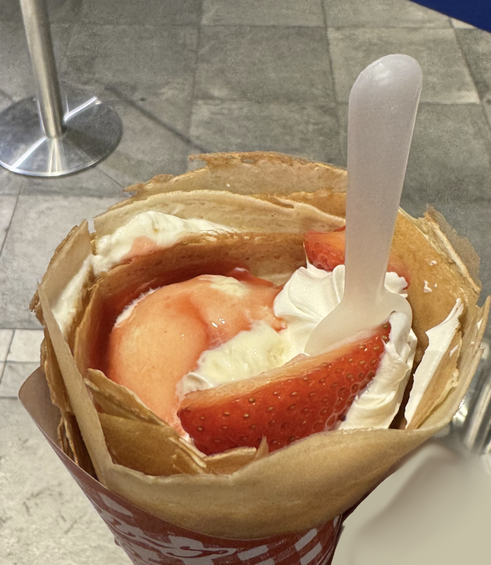
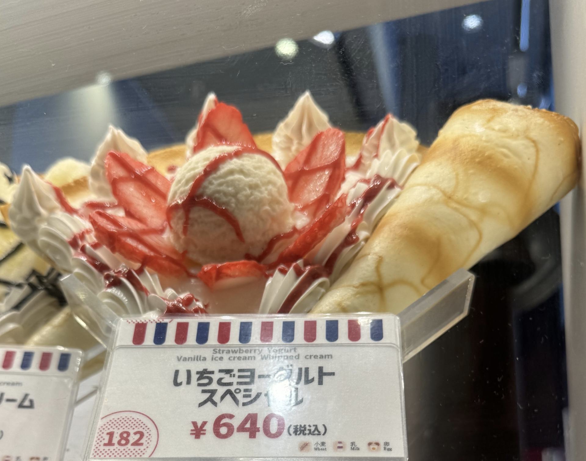
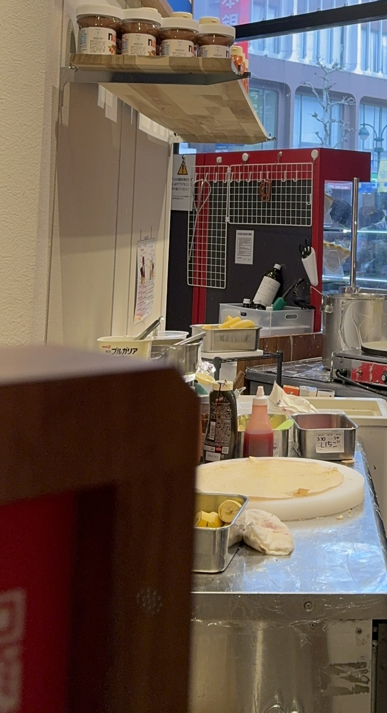

# Sleuths and Sweets

'I visited my friend in Japan, and we had some decent crepes! The area was bustling with foot traffic, so we expected a long wait, but it ended up being okay. I’m usually not a fan of yogurt in my crepes, but I was content with it.

Finding a seat was difficult because the place was crowded, and walking elsewhere to eat wasn’t an option, as it’s culturally considered rude to eat while walking in Japan.'

 - Japan, bustling with foot traffic
 - Japanese in pictures (japan bank)

We can know the name of shop is 'marion crepes' with crepe design in the picture. Then find that shop nearby 'japan bank'.

flag is: **irisctf{1_Chome_21_3_Jinnan_Shibuya}**